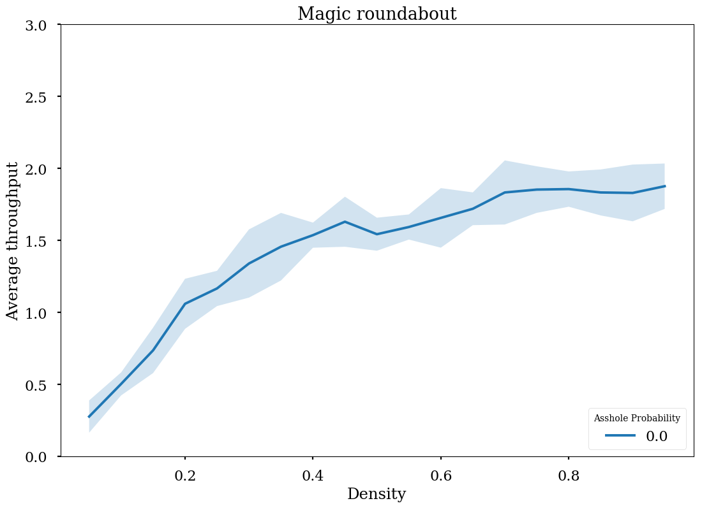

# Project Computational Science 2020 :car::taxi::bus::police_car::blue_car::articulated_lorry:

This repository contains all files necessary for running the simulations used by project group 13 in the Project Computational Science course at the University of Amsterdam.

Please see [Reproducability](#reproducability) on how to reproduce a given figure.

## Group members
Dorian Bekaert, Florine de Geus, Elisha Nieuwburg

## Environment setup

We recommend running the simulations through a *virtual environment* ([venv](https://packaging.python.org/guides/installing-using-pip-and-virtual-environments/)). If you have not installed this yet on your machine, you can do so by using the commands below (do make shure you have Python 3 installed. We use Python 3.6.9):

For Linux/macOS:
```bash
$ python3 -m pip install --user virtualenv
```
For Windows:
```bash
$ py -m pip install --user virtualenv
```

### Creating and activating the virtual environment

Creating a new virtual environment can be done by running the following commands:

```bash
$ virtualenv venv/ -p /usr/bin/python3
$ source venv/bin/activate
$ pip install -r requirements.txt
```

The first line creates a new environment. You only have to run this command once.
The second line activates the environment. You need to run this command each time you revisit the project.
The third line installs all project dependencies in the virtual environment. It is good practice to run this command after each `pull`.

To exit the environment, simply type
```
$ deactivate
```
Remember to reactivate the environment when you return to the project.

It is possible to run the project without a virtual environment, though not recommended, since it might interfere with the python dependencies currently installed on your machine.

## Running the simuations

Simulations can be ran using `main.py`, which allows for setting different parameters:

```
$ ./main.py -h

usage: main.py [-h] [-d DENSITY] [-i ITERATIONS] [-s SIMULATIONS] [-a]
               [-o [OUTPUT]] [-p] [-m] [-A ASSHOLE_PROBABILITY]
               {regular,turbo,magic}

Driver program for running roundabout simulations.

positional arguments:
  {regular,turbo,magic}
                        roundabout type

optional arguments:
  -h, --help            show this help message and exit
  -d DENSITY, --density DENSITY
                        car density (default: 0.5)
  -i ITERATIONS, --iterations ITERATIONS
                        number of iterations (default: 1000)
  -s SIMULATIONS, --simulations SIMULATIONS
                        number of simulations (default: 10)
  -a, --animate         show the animations (automatically disabled in
                        combination with --multithreading) (default: False)
  -o [OUTPUT], --output [OUTPUT]
                        store the results in an output file specified by the
                        given directory (default: False)
  -p, --print           print the results to stdout (default: False)
  -m, --multithreading  use multithreading to speed up the simulation process
                        (default: False)
  -A ASSHOLE_PROBABILITY, --asshole_probability ASSHOLE_PROBABILITY
                        asshole probability for a car (default: 0)
```

### Examples
```
$ ./main.py magic -d 0.8 -i 500 -s 1 -p -a
```
Runs one simulation on a magic roundabout with a car density of 0.8 and 500 time steps. Animates the simulation and prints the results to stdout.

```
$ ./main.py turbo -d 0.2 -i 2000 -s 15 -o output -A 0.05 -m
```
Runs 15 simulations on a turbo roundabout, each with a car density of 0.2 and 2000 time steps. Write the results to a file in a directory called `output` (make sure this directory already exists). An asshole probability of 0.05 is used, which means 5% of the cars will sometimes stand still on the road. Use multithreading to speed up to execute multiple simulations in parallel.

### Running the experiments

To run a series of experiments, run
```
$ ./run_tests.sh STEPS SIMULATIONS P_ASSHOLE
```
Here, `STEPS` is the number of time steps per simulation, `SIMULATIONS` is the number of simulations per density and `P_ASSHOLE` the asshole probability.

## Reproducability



To reproduce the figure above, please follow these steps:

1. Make sure all dependencies in `requirements.txt` are installed. Optionally (but recommended), follow [these steps](#environment-setup).

2. Run the following command. This will start the simulations. It can take a while before it is finished.
 ```
$ ./run_tests.sh 150 5 0
```
3. In the `output` directory there are `.csv` files containing the simulation data for each density for each roundabout.

4. Run the command below. Add `-s` if you also want to save the generated figures. The figures will be stored in the `figures` directory.

```
$ ./process_data.py 100 0.0
```

The figure should look relatively similar to the one shown above.
